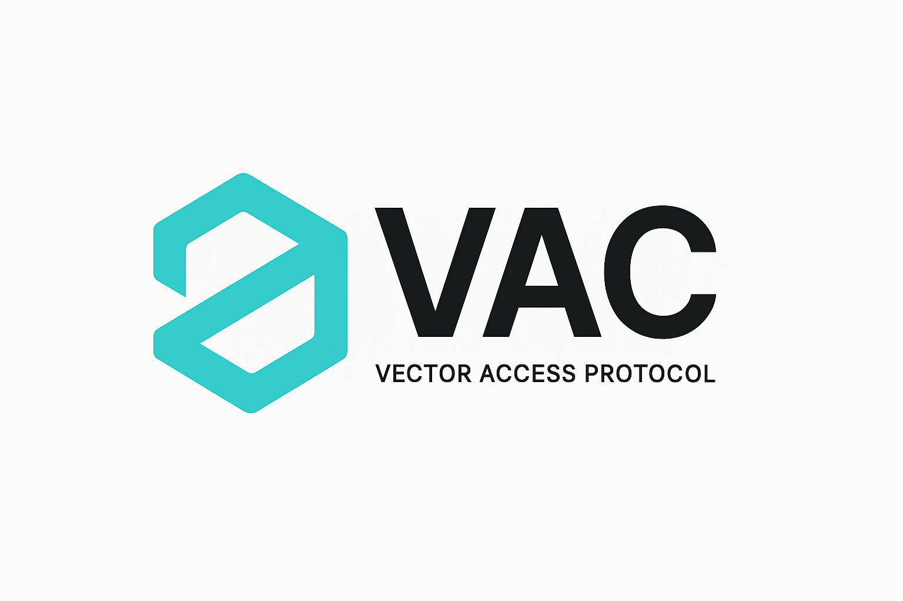

# VAC: Vector Access Protocol

## An Open Standard for Making Websites Understandable to AI

**Author**: Giuseppe Marci  
**License**: MIT  
**Version**: 0.1  
**Date**: July 24, 2025

---

## Overview

Today's web was built for humans and traditional search engines. It relies on HTML, keywords, and structured data to provide discoverability. But this model does not serve AI systems well. Large language models work differently — they understand through context, embeddings, and vectors.

To bridge this gap, we introduce **VAC**, short for **Vector Access Protocol**. VAC enables any website to expose its content in a format designed for machines, allowing LLMs and AI agents to retrieve and understand it semantically.

The core format is a simple file called `.well-known/vectors.json`, which provides pre-computed vector embeddings of website content.

This allows AI tools to interact with your website meaningfully, without the need to scrape, crawl blindly, or re-embed your content from scratch.

---

## Why This Matters

Language models and semantic search engines need high-quality, structured data to reason well. But most content on the internet is locked inside HTML, scattered across pages, and unoptimized for vector-based retrieval.

VAC solves this problem by letting websites serve their own high-quality vectors. It is lightweight, privacy-friendly, easy to integrate, and open by design.

This is the next evolution in how content is published online. Not just for people. Not just for bots. But for intelligent systems that can reason with meaning.

---

## The `.well-known/vectors.json` Format

To make your site machine-readable via VAC, you publish a single file at the following path:

```
https://yourdomain.com/.well-known/vectors.json
```

### Example:

```json
{
  "version": "0.1",
  "site": "https://yourdomain.com",
  "updatedAt": "2025-07-24T12:00:00Z",
  "chunks": [
    {
      "url": "https://yourdomain.com/about",
      "content": "We are building the future of semantic web",
      "vector": [0.42, -0.67, ...],
      "metadata": {
        "title": "About Us",
        "tags": ["company", "mission", "team"]
      }
    }
  ]
}
```

### Key fields:

- `url`: The page the vector came from
- `content`: The text chunk that was embedded
- `vector`: The embedding itself (a list of floats)
- `metadata`: Optional information such as title, tags, language, etc.

---

## How It Works

A VAC-compatible system — such as a crawler, LLM, or AI tool — can fetch your `vectors.json`, read the semantic chunks, and use the vectors to answer questions, find relevant content, or ground its responses.

You choose the embedding model (for example, OpenAI, Cohere, or a local model like `nomic-embed-text`). The system consuming the vectors does not need to recompute anything — it just reads and uses them.

---

## The VAC API (Optional)

For dynamic content or larger datasets, VAC also supports an optional API approach.

### Example endpoints:

- `GET /vac/manifest`  
  Returns metadata about your site's VAC implementation

- `POST /vac/query`  
  Accepts a search query or vector and returns the most relevant chunks

### Sample query:

```json
{
  "query": "how to protect crypto wallets",
  "top_k": 3
}
```

### Sample response:

```json
{
  "results": [
    {
      "url": "https://yourdomain.com/security-guide",
      "score": 0.94,
      "content": "Always use cold storage and never share your seed phrase.",
      "metadata": {
        "title": "Crypto Security Tips"
      }
    }
  ]
}
```

This makes it possible to turn your website into an AI-friendly vector database without deploying one.

---

## Benefits of VAC

- Your site becomes LLM-accessible instantly
- AI agents can query your content without scraping
- You retain full control over what's exposed
- Great for knowledge bases, docs, blogs, legal content, or even app UIs
- Lightweight, works on any hosting environment
- Future-proof and privacy-respecting

---

## Use Cases

- A documentation site wants ChatGPT to understand its API without a plugin
- A personal blog wants to be indexed by a vector-based search engine
- A Web3 project wants AI to understand its protocol, directly from its landing page
- A legal portal wants to surface the right answer to a user query, even from multiple buried subpages

VAC makes all of this possible, without needing to register with any third party.

---

## Best Practices

- Start by embedding your homepage and most important content
- Split long pages into chunks of 300 to 500 tokens
- Keep vectors consistent in format (use the same model and dimension across all chunks)
- Refresh your vectors.json whenever content changes
- Always test your output locally using an LLM like Ollama or a VAC-compatible reader

---

## Roadmap

- Finalize and publish the VAC spec
- Launch CLI tool and starter kits for frameworks like Next.js and Astro
- Support optional verification via signed metadata headers
- Integrate VAC reading capabilities into open-source LLM agents
- Propose VAC as a semantic web standard to W3C and ecosystem partners

---

## Why Not Just Use RAG or Crawl?

You could, but:

- It wastes compute and bandwidth
- You lose semantic fidelity due to outdated snapshots
- It forces AI to interpret raw HTML instead of curated knowledge chunks
- It breaks when content changes
- It scales poorly across millions of sites

VAC offers a direct channel from the source to the AI.

---

## Final Thoughts

VAC gives websites a voice in the semantic internet. Not just as text on pages, but as structured meaning that AI can understand and act on.

With one file, you can make your site accessible to a new generation of tools — from LLMs to intelligent crawlers, semantic search engines, and autonomous agents.

The future web is not just readable. It's understandable. VAC is how we get there.

---

# vac-cli

A command-line tool for generating VAC-compliant `.well-known/vectors.json` files — making websites AI-readable through semantic embeddings.

## 📦 Installation

```bash
# Clone the repository
git clone https://github.com/giusmarci/vac-vector-access-protocol
cd vac-vector-access-protocol

# Install dependencies in the CLI directory
cd cli
pnpm install
# or npm install
# or yarn install
cd ..
```

## 🛠️ Prerequisites

- Node.js 16+
- [Ollama](https://ollama.ai/) installed and running for local embeddings
- The `nomic-embed-text` model (or any compatible embedding model):

```bash
# Pull the embedding model
ollama pull nomic-embed-text

# Start Ollama server
ollama serve
```

## 🎯 Usage

### Basic Usage

```bash
cd cli
node index.js
```

The CLI will guide you through an interactive process:

1. **Enter a website URL** - The site you want to vectorize
2. **Automatic page discovery** - Finds pages via sitemap.xml or crawling
3. **Choose embedding scope**:
   - 🔹 Embed ALL pages
   - 🔹 Choose how many pages
   - 🔹 Only embed homepage
4. **Processing** - Chunks and embeds content
5. **Output** - Creates `exports/websitename/.well-known/vectors.json`

### Command-Line Options (Coming Soon)

```bash
# Generate vectors for a specific URL
vac-cli generate https://example.com

# Use a different embedding model
vac-cli generate https://example.com --model text-embedding-ada-002

# Limit the number of pages
vac-cli generate https://example.com --max-pages 10

# Specify output directory
vac-cli generate https://example.com --output ./custom-dir
```

## 📄 Output Format

### Standard VAC Format

The tool generates VAC-compliant output with the following structure:

```json
{
  "version": "0.1",
  "site": "https://example.com",
  "model": "nomic-embed-text",
  "updatedAt": "2025-07-23T18:00:00Z",
  "totalChunks": 42,
  "chunks": [
    {
      "id": "home-1",
      "url": "https://example.com",
      "content": "Welcome to our website...",
      "vector": [0.123, -0.456, ...],
      "metadata": {
        "tokens": 351,
        "title": "Homepage"
      }
    }
  ]
}
```

### Large Sites Support

For websites that generate more than 10MB of vector data, the tool automatically implements chunked output:

**Index file** at `.well-known/vectors.json`:
```json
{
  "version": "0.1",
  "site": "https://example.com",
  "model": "nomic-embed-text",
  "updatedAt": "2025-07-23T18:00:00Z",
  "chunked": true,
  "files": [
    {
      "url": "https://example.com",
      "file": "/vectors/home.json",
      "chunks": 5
    },
    {
      "url": "https://example.com/about",
      "file": "/vectors/about.json",
      "chunks": 3
    }
  ]
}
```

## 🌟 Features

- **Smart Discovery**: Automatically finds pages via sitemap.xml or intelligent crawling
- **Semantic Chunking**: Splits content at sentence boundaries (300-600 tokens per chunk)
- **Local Embeddings**: Uses Ollama for privacy-preserving local computation
- **Multiple Model Support**: Compatible with various embedding models
- **Scalable Output**: Handles large sites by splitting into multiple files
- **Progress Tracking**: Real-time updates during processing
- **VAC Compliant**: Generates spec-compliant output ready for production

## 🧪 Testing Your Output

### Local Testing

Serve your vectors.json locally:

```bash
# Using Node.js
cd exports/example.com  # Replace with your website name
npx serve .

# Using Python
cd exports/example.com  # Replace with your website name
python -m http.server 8000
```

Then access:
- `http://localhost:3000/.well-known/vectors.json`

### Testing with AI

Test your VAC implementation by:

1. Sharing the URL with an LLM and asking it to understand your site
2. Using a VAC-compatible client to query your vectors
3. Building a simple similarity search using the vectors

## 🔧 Configuration

The tool uses sensible defaults optimized for VAC compliance:

- **Chunk size**: 300-600 tokens (optimal for most embedding models)
- **Model**: nomic-embed-text (768 dimensions, fast and accurate)
- **Crawler limits**: Max 20 pages, depth 2 (configurable)
- **File split threshold**: 10MB (for compatibility)
- **Supported formats**: HTML, Markdown, Plain text

### Custom Configuration (Coming Soon)

Create a `vac.config.json` file:

```json
{
  "model": "text-embedding-ada-002",
  "chunkSize": {
    "min": 200,
    "max": 500
  },
  "crawler": {
    "maxPages": 50,
    "maxDepth": 3,
    "respectRobotsTxt": true
  },
  "output": {
    "directory": "./public",
    "splitThreshold": "5MB"
  }
}
```

## 📊 Example Workflows

### For a Blog

```bash
# Generate vectors for your blog
cd cli
node index.js

# Enter your blog URL when prompted
https://myblog.com

# Choose to embed all posts
# The tool will find all your blog posts and create semantic embeddings
```

### For Documentation

```bash
# Perfect for making docs AI-searchable
cd cli
node index.js

# Enter your docs site
https://docs.myproject.com

# The tool will preserve the structure and create searchable chunks
```

### For E-commerce

```bash
# Make product catalogs AI-understandable
cd cli
node index.js

# Enter your store URL
https://mystore.com

# Vectors will include product descriptions, categories, and metadata
```

## 🤝 Contributing

This is an open standard proposal. We welcome:

- Protocol improvements and suggestions
- Implementation feedback
- Use case examples
- Integration stories
- Bug reports and feature requests

### Development Setup

```bash
# Clone the repo
git clone https://github.com/giusmarci/vac-vector-access-protocol
cd vac-vector-access-protocol

# Install dependencies
cd cli
pnpm install
cd ..

# Run tests
pnpm test

# Run in development mode
pnpm dev
```

## 🐛 Troubleshooting

### Common Issues

**Ollama not running**
```bash
# Start Ollama
ollama serve
```

**Model not found**
```bash
# Pull the required model
ollama pull nomic-embed-text
```

**Large site taking too long**
- Use the page limit option
- Consider running on a subset first
- Check your internet connection

## 📚 Resources

- [VAC Protocol Specification](https://github.com/giusmarci/vac-vector-access-protocol)
- [Ollama Documentation](https://github.com/ollama/ollama)
- [Well-Known URIs (RFC 8615)](https://www.rfc-editor.org/rfc/rfc8615.html)
- [Semantic Web Standards](https://www.w3.org/standards/semanticweb/)

## 🚀 What's Next

- **Framework Integrations**: Next.js, Astro, Gatsby plugins
- **Cloud Support**: Vercel, Netlify edge functions
- **API Mode**: Real-time vector generation
- **Multiple Models**: Support for OpenAI, Cohere, Anthropic
- **Vector Search**: Built-in similarity search capabilities

## 📄 License

MIT License - See LICENSE file for details

---

**Built with ❤️ for the semantic web**

Join the movement to make the internet understandable by AI. Start by adding VAC to your website today.

---

## 📁 Project Structure

```
vac-vector-access-protocol/
├── README.md                    # This file
├── LICENSE                      # MIT License
├── .well-known/                 
│   └── vectors.json            # Example implementation
├── cli/                        # VAC CLI tool
│   ├── index.js
│   ├── README.md
│   └── package.json
├── docs/                       
│   ├── explainer.md            # WICG proposal document
│   ├── index.md                # Documentation home
│   └── usage.md                # Integration guide
├── examples/                   # Example implementations
│   ├── minimal-site/
│   └── advanced-site/
├── spec/                       
│   └── vectors.schema.json     # JSON Schema definition
└── logo/                       
    └── vac-header.png          # Project branding
```

## 🎯 For WICG Submission

- **[Protocol Explainer](docs/explainer.md)** - Full technical proposal document
- **[JSON Schema](spec/vectors.schema.json)** - Formal specification
- **[Examples](examples/)** - Reference implementations

## 🤝 Call for Contributors

Seeking community input to refine and standardize VAC:

- **Protocol Design**: Help shape the specification
- **Implementations**: Build tools and integrations
- **Use Cases**: Share your deployment experiences
- **Documentation**: Improve guides and examples

Join the discussion at [GitHub Discussions](https://github.com/giusmarci/vac-vector-access-protocol/discussions)